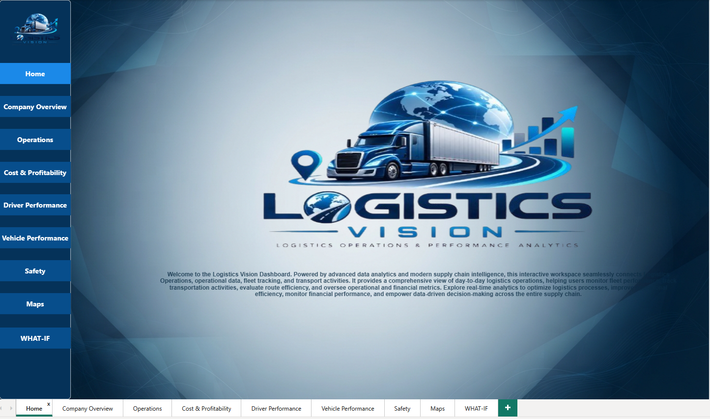
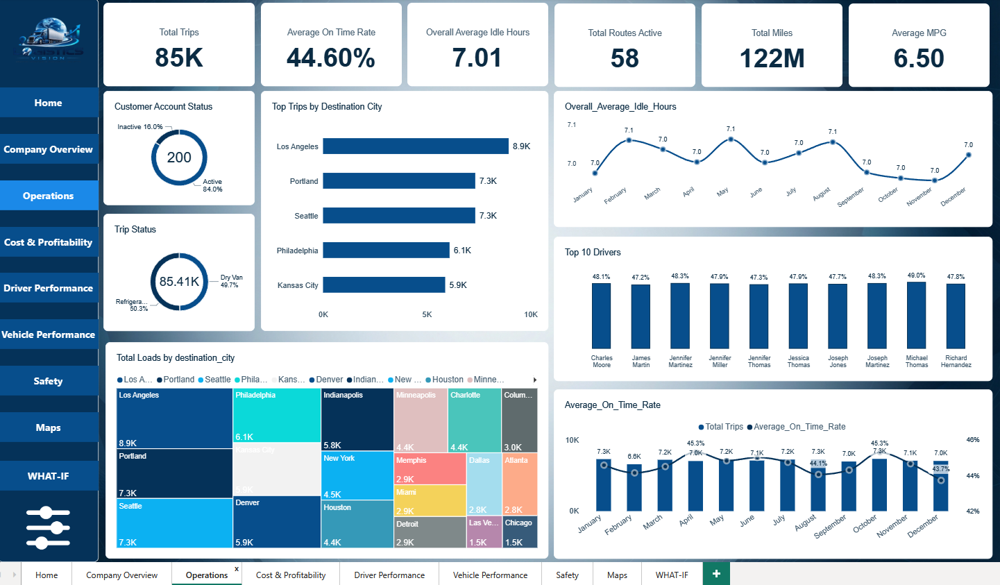
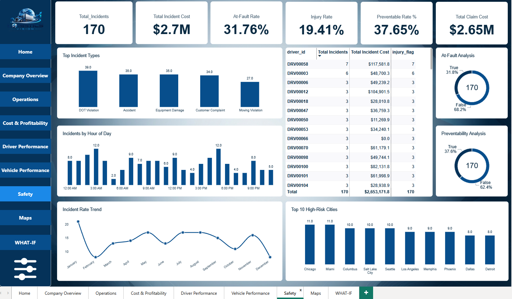
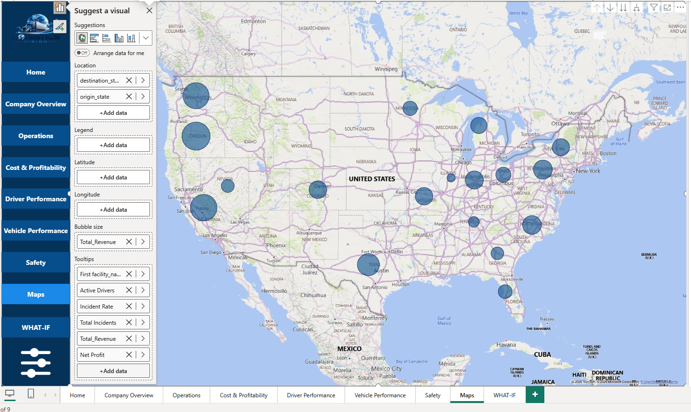

# 🚚 Logistics Vision - Logistics Operations Dashboard

A comprehensive Business Intelligence project built with **Power BI** to evaluate logistics operations, fleet performance, financial metrics, and route efficiency.

## 📊 Project Overview

This interactive workspace connects operational data and transport activities to empower data-driven decision-making across the supply chain. The project involves structuring a robust relational data model, utilizing **Power Query** for seamless data transformation, and formulating advanced **DAX** measures to evaluate complex logistics metrics.

## 📂 Repository Files

* 📊 **Power BI Dashboard:** [Download Final.pbix](Final.pbix) - Access the full interactive model, relationships, and DAX calculations.
* 📑 **Presentation Slides:** [Logistics_Intelligence_Presentation (3).pptx](Logistics_Intelligence_Presentation%20%283%29.pptx) - Explore the project presentation and summary deck.
* 🚀 **Release v1.0.0:** [View Release](https://github.com/islamyasser424-design/Logistics-Vision-Fleet-Supply-Chain-Analytics-Dashboard/releases/tag/v1.0.0) - Access the official project release and published version.
* 🖼️ **Dashboard Previews:** High-resolution screenshots of the data model and all interactive pages are embedded below.

---

## 🗄️ Data Model Architecture

A robust relational schema (Star Schema) designed for optimal performance, efficient filtering, and advanced DAX calculations.

---

## 📸 Dashboard Pages

### 🏠 Home

Welcome landing page for seamless navigation.

### 🏢 Company Overview

High-level summary of total revenue, gross margins, and active operations.

### ⚙️ Operations

Day-to-day logistics metrics, trip statuses, and on-time delivery rates.

### 💰 Cost & Profitability

Detailed breakdown of maintenance costs, fuel expenses, and profit margins.

### 👨‍✈️ Driver Performance

Insights into driver efficiency, MPG trends, and on-time performance.

### 🚛 Vehicle Performance

Fleet status, utilization rates, and detailed truck maintenance tracking.

### 🛡️ Safety

Incident tracking, cost of damages, and preventability analysis.

### 🗺️ Maps

Geospatial distribution of revenue, active drivers, and facility locations.

### 🔮 WHAT-IF Scenarios

Dynamic scenario analysis for freight rate adjustments and fuel price fluctuations.

